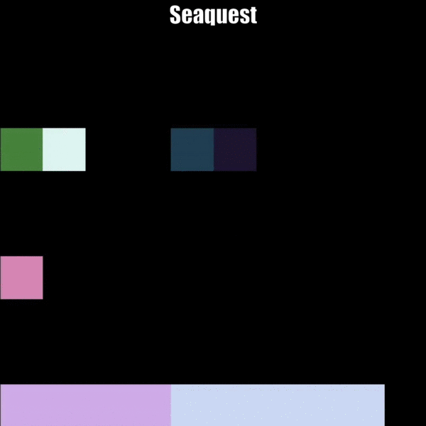
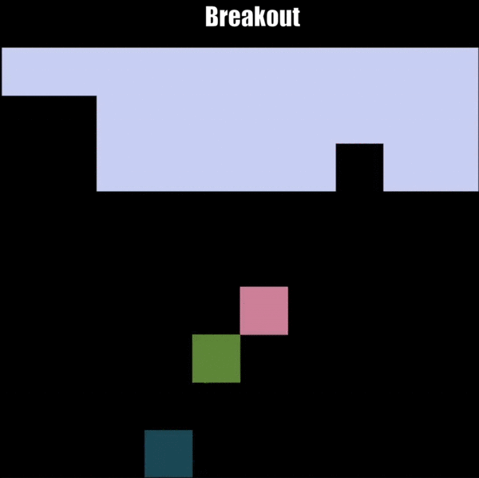
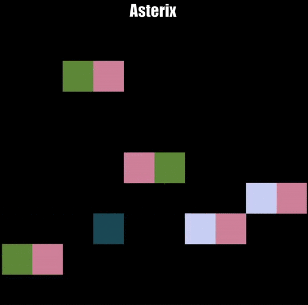
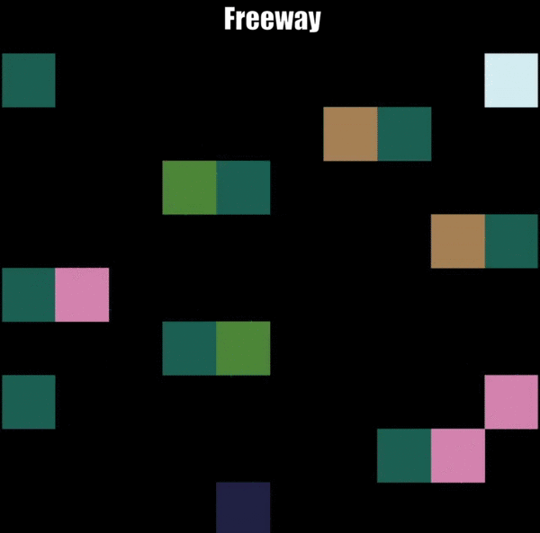
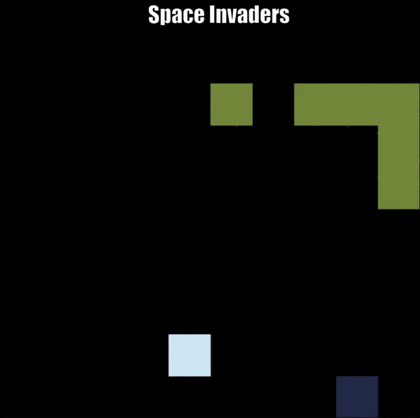
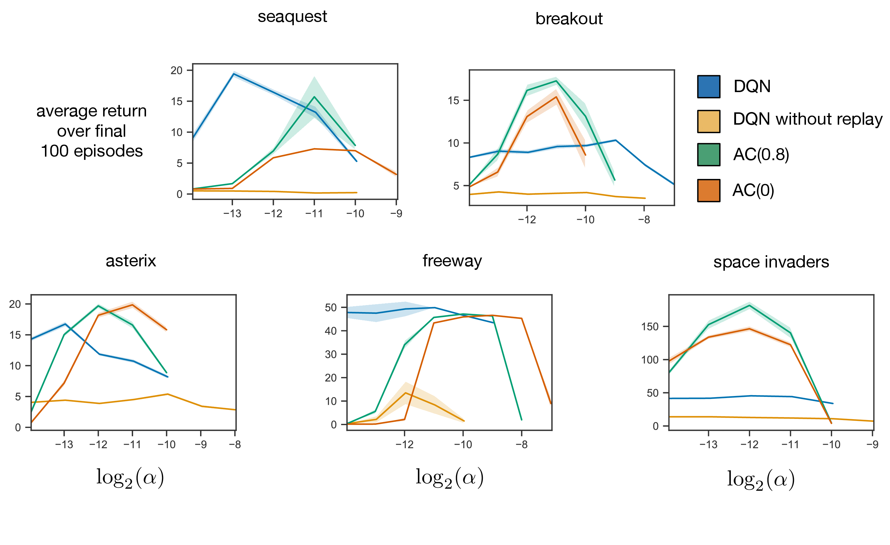
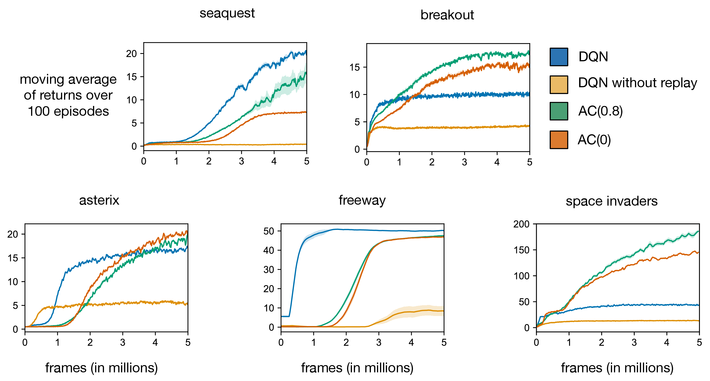

# GoAtar
GoAtar is a `Go` implementation of [MinAtar](https://github.com/kenjyoung/MinAtar) written completely in `Go`. This module does not provide bindings for [MinAtar](https://github.com/kenjyoung/MinAtar), but rather is a transliteration of [MinAtar](https://github.com/kenjyoung/MinAtar) in `Go`.

From the [MinAtar](https://github.com/kenjyoung/MinAtar) Github page:
> MinAtar is inspired by the Arcade Learning Environment (Bellemare et. al. 2013) but simplifies the games to make experimentation with the environments more accessible and efficient. Currently, MinAtar provides analogues to five Atari games which play out on a 10x10 grid. The environments provide a 10x10xn state representation, where each of the n channels correspond to a game-specific object, such as ball, paddle and brick in the game Breakout.

<p  align="center">


</p>
<p  align="center">



</p>

## Quick Start
To use GoAtar, you'll need `Go` 1.16 or later. GoAtar does not provide any implementations of learning algorithms. To install GoAtar:
```go
go get -u github.com/samuelfneumann/goatar
```

## Major differences between GoAtar and [MinAtar](https://github.com/kenjyoung/MinAtar)
* GoAtar `StateShape()` returns the state shape as `(number of channels,
number of rows, number of cols)` in the state observation tensor. MinAtar
returns `(number of rows, number of cols, number of channels)`. This
is due to the fact that no n-dimensional arrays exist in GoNum. Instead,
states are representd as a `[]*mat.Dense`, where the number of elements in
the slice is equal to the number of channels.

* `Go` does not have n-dimensional arrays. There is a
[tensor package](https://pkg.go.dev/gorgonia.org/tensor), but the efficiency of
using n-dimensional arrays is dependent on
[hardware and the operations being done](https://github.com/gonum/matrix/issues/400).
Because of this, the tensor package may not be as efficient as using `[]float64`
directly. Therefore, this module returns state observations as (single dimensional)
`[]float64`, and it is up to the user to reshape this slice (which can
be done using the sizes returned by `StateShape()`). This should be an
efficient operation for both [gorgonia/tensor](https://pkg.go.dev/gorgonia.org/tensor)
and [gonum/mat](https://pkg.go.dev/gonum.org/v1/gonum/mat) because the
underlying `[]float64` for a matrix or tensor can easily be set: no copying
of data is needed (which is much more efficient than the `Python` implementation
of using `bool`s to represent positions). For example:
```go
e := ... // New GoAtar environment

// Gorgonia tensors can be efficiently constructed from the State() method.
// No data is never copied - unlike in Python
t := tensor.New(
    tensor.WithShape(e.StateShape()...),
    tensor.WithBacking(e.State()),
)

// Create a vector of the state observation
prod := func(ints ...int) int {
    product := 1
    for _, value := range ints {
        product *= value
    }
    return product
}
v := mat.NewVecDense(prod(e.StateShape()...), e.State())

// Create a matrix from a single channel of the state observation
r, c, _ := e.StateShape()
ch := 1 // The channel to get
m := mat.NewDense(r, c, e.Channel(ch))
```

* In *SpaceInvaders*, the game starts with the player's position randomly
chosen from one of the `cols/2` middle positions. E.g. with the default
columns set as `10`, the player can start in any `x` position in `{3, 4,
5, 6, 7}`. This adds a bit of randomness to the game.

## Visualizing the Environments
Currently not supported.

## Support for Other Languages
- [Python](https://github.com/kenjyoung/MinAtar)
- [Julia](https://github.com/mkschleg/MinAtar.jl)

## Results from [MinAtar](https://github.com/kenjyoung/MinAtar)
The following plots display results for DQN (Mnih et al., 2015) and actor-critic (AC) with eligibility traces. Our DQN agent uses a significantly smaller network compared to that of Mnih et al., 2015. We display results for DQN with and without experience reply. Our AC agent uses a similar architecture to DQN, but does not use experience replay. We display results for two values of the trace decay parameter, 0.8 and 0.0.  Each curve is the average of 30 independent runs with different random seeds. The top plots display the sensitivity of final performance to the step-size parameter, while the bottom plots display the average return during training as a function of training frames. For further information, see the paper on MinAtar available [here](https://arxiv.org/abs/1903.03176).




## Games
So far we have implemented analogues to five Atari games in MinAtar as follows. For each game, we include a link to a video of a trained DQN agent playing.

### Asterix
The player can move freely along the 4 cardinal directions. Enemies and treasure spawn from the sides. A reward of +1 is given for picking up treasure. Termination occurs if the player makes contact with an enemy. Enemy and treasure direction are indicated by a trail channel. Difficulty is periodically increased by increasing the speed and spawn rate of enemies and treasure.

[Video](https://www.youtube.com/watch?v=Eg1XsLlxwRk)

### Breakout
The player controls a paddle on the bottom of the screen and must bounce a ball to break 3 rows of bricks along the top of the screen. A reward of +1 is given for each brick broken by the ball.  When all bricks are cleared another 3 rows are added. The ball travels only along diagonals. When the ball hits the paddle it is bounced either to the left or right depending on the side of the paddle hit. When the ball hits a wall or brick, it is reflected. Termination occurs when the ball hits the bottom of the screen. The ball's direction is indicated by a trail channel.

[Video](https://www.youtube.com/watch?v=cFk4efZNNVI&t)

### Freeway
The player begins at the bottom of the screen and the motion is restricted to travelling up and down. Player speed is also restricted such that the player can only move every 3 frames. A reward of +1 is given when the player reaches the top of the screen, at which point the player is returned to the bottom. Cars travel horizontally on the screen and teleport to the other side when the edge is reached. When hit by a car, the player is returned to the bottom of the screen. Car direction and speed is indicated by 5 trail channels.  The location of the trail gives direction while the specific channel indicates how frequently the car moves (from once every frame to once every 5 frames). Each time the player successfully reaches the top of the screen, the car speeds are randomized. Termination occurs after 2500 frames have elapsed.

[Video](https://www.youtube.com/watch?v=gbj4jiTcryw)

### Seaquest
The player controls a submarine consisting of two cells, front and back, to allow direction to be determined. The player can also fire bullets from the front of the submarine. Enemies consist of submarines and fish, distinguished by the fact that submarines shoot bullets and fish do not. A reward of +1 is given each time an enemy is struck by one of the player's bullets, at which point the enemy is also removed. There are also divers which the player can move onto to pick up, doing so increments a bar indicated by another channel along the bottom of the screen. The player also has a limited supply of oxygen indicated by another bar in another channel. Oxygen degrades over time and is replenished whenever the player moves to the top of the screen as long as the player has at least one rescued diver on board. The player can carry a maximum of 6 divers. When surfacing with less than 6, one diver is removed. When surfacing with 6, all divers are removed and a reward is given for each active cell in the oxygen bar. Each time the player surfaces the difficulty is increased by increasing the spawn rate and movement speed of enemies. Termination occurs when the player is hit by an enemy fish, sub or bullet; or when oxygen reaches 0; or when the player attempts to surface with no rescued divers. Enemy and diver directions are indicated by a trail channel active in their previous location to reduce partial observability.

[Video](https://www.youtube.com/watch?v=W9k38b5QPxA&t)

### Space Invaders
The player controls a cannon at the bottom of the screen and can shoot bullets upward at a cluster of aliens above. The aliens move across the screen until one of them hits the edge, at which point they all move down and switch directions. The current alien direction is indicated by 2 channels (one for left and one for right) one of which is active at the location of each alien. A reward of +1 is given each time an alien is shot, and that alien is also removed. The aliens will also shoot bullets back at the player. When few aliens are left, alien speed will begin to increase. When only one alien is left, it will move at one cell per frame. When a wave of aliens is fully cleared, a new one will spawn which moves at a slightly faster speed than the last. Termination occurs when an alien or bullet hits the player.

[Video](https://www.youtube.com/watch?v=W-9Ru-RDEoI)

## Citing MinAtar
If you use MinAtar in your research please cite the following:

Young, K. Tian, T. (2019). MinAtar: An Atari-Inspired Testbed for Thorough and Reproducible Reinforcement Learning Experiments.  *arXiv preprint arXiv:1903.03176*.

In BibTeX format:

```
@Article{young19minatar,
author = {{Young}, Kenny and {Tian}, Tian},
title = {MinAtar: An Atari-Inspired Testbed for Thorough and Reproducible Reinforcement Learning Experiments},
journal = {arXiv preprint arXiv:1903.03176},
year = "2019"
}
```

## References
Bellemare, M. G., Naddaf, Y., Veness, J., & Bowling, M. (2013). The arcade learning environment: An evaluation platform for general agents. *Journal of Artificial Intelligence Research*, 47, 253–279.

Mnih, V., Kavukcuoglu, K., Silver, D., Rusu, A. A., Veness, J., Bellemare, M. G., . . . others (2015). Human-level control through deep reinforcement learning. *Nature*, 518(7540), 529.

# ToDo
- [ ] Make the entire package have a more OOP approach. E.g. instead of each
package having its own `player`, the `game` package should have an implementation of
a `player` with decorators so that each sub-package can modify the playerse as
needed. E.g. `asterix` might need a `NewHorizontalMoving(NewPlayer(...))` and `breakout`
might need a `NewShooting(NewVerticalMoving(NewHorizontalMoving(NewPlayer(...))))`.
In this case, the `player` interface can just have a `move(rune)` method which
takes care of moving based on the action `'u', 'd', 'r', 'l', 'n', 'f'`.
